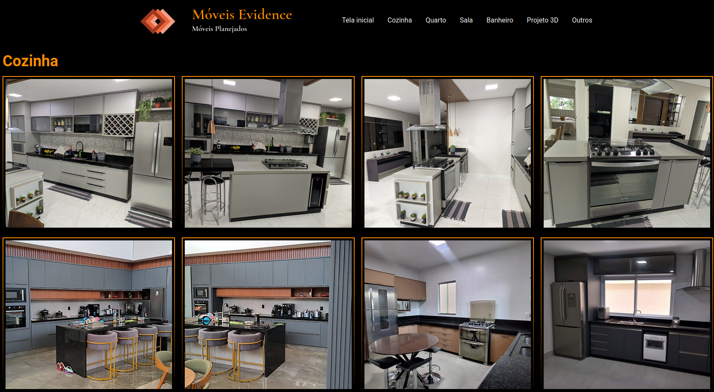
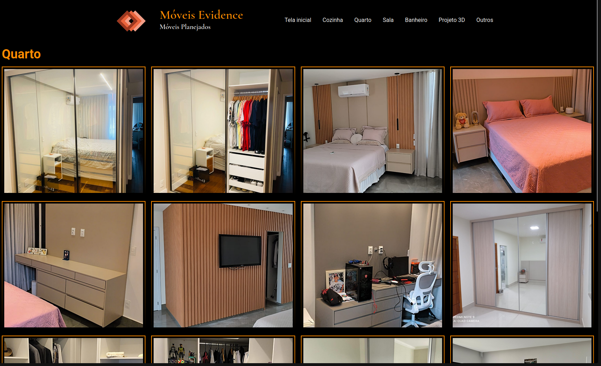

# 🖼️ Móveis Evidence: Landing Page de Portfólio

Este projeto é uma **Landing Page** (Página de Destino) desenvolvida para a empresa **Móveis Evidence** (DF - Marcenaria), com o objetivo principal de exibir o portfólio de projetos finalizados de forma visualmente atraente e profissional para clientes em potencial.

O foco é transformar a qualidade do trabalho da marcenaria em uma experiência digital envolvente, que serve como uma ferramenta de vendas e inspiração.

### 🔗 Acesse a Landing Page: [Clique aqui para ver o portfólio completo!](https://ramalho-sites.github.io/Moveis-Evidence/)

---

## 🎯 Destaques do Projeto

* **Vitrine Digital:** Criação de um ambiente online focado em imagens de alta qualidade para evidenciar o acabamento e a qualidade dos projetos de marcenaria.
* **Foco no Cliente:** Design pensado para facilitar a navegação do cliente, permitindo que ele encontre rapidamente inspiração e informações de contato.
* **Design Responsivo:** A página adapta-se perfeitamente a qualquer dispositivo (celulares, tablets e desktops), garantindo que o portfólio seja acessível em qualquer lugar.
* **SEO Básico:** Estrutura HTML semanticamente otimizada para melhor ranqueamento em buscas locais (DF - Marcenaria).

---

## 🛠️ Tecnologias Utilizadas

| Tecnologia | Função no Desenvolvimento |
| :--- | :--- |
| **HTML5** | Estrutura semântica (cabeçalho, galeria, rodapé) focada em clareza e SEO. |
| **CSS3** | Estilização avançada, layout Flexbox/Grid e técnicas de design que enfatizam a fotografia (ex: Lightbox ou Carrossel). |
| **JavaScript (ES6+)** | Lógica de interatividade: menus de navegação (hamburger menu) e possíveis efeitos de galeria ou lazy loading de imagens. |

---

## 👨‍💻 Autor

###### Projeto desenvolvido por **Davi Ramalho** para o cliente Móveis Evidence (DF).

